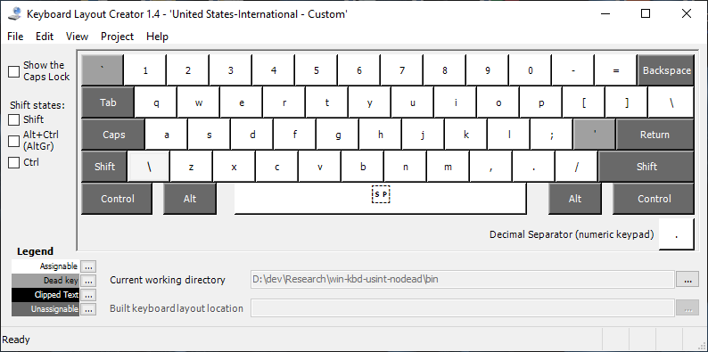

# US International Layout (no dead keys) for Windows

By default, Windows includes a layout called United States-International, which allows typing many non-ASCII characters. It is very useful for several Latin-script based languages.

The layout also designates several keys as "dead keys", particularly the apostrophe (') and double quotes ("). So to enter double quotes, you have to type " followed by space. Some other characters are available by using AltGr as a dead key.

For some use cases, this can be annoying, in particular if you don't need the non-ASCII characters that are entered with the help of those dead keys. With the US-International layout, you can type several languages by only using the AltGr dead key. For example, you can type ä å ö ü ß ø æ by using various AltGr combinations, meaning AltGr is sufficient for German, Danish, Norwegian and Swedish among others.

This repository contains a layout that is like United States-International but removes the apostrophe ('), double quotes ("), circumflex (^), backtick (``) and tilde (~) as dead keys, while leaving the AltGr dead key combinations intact.

## Keyboard layouts

### United States-International - AltGr - No Dead Keys

#### [United States-International - Default](us_international_default.klc)

#### [United States-International - AltGr - No Dead Keys](us_international_no_dead_keys.klc)

### Danish - No Dead Keys

#### [Danish - Default](dk_default.klc)

#### [Danish - No Dead Keys](dk_no_dead_keys.klc)

## How to build / install

The layout file can be opened with [Microsoft Keyboard Layout Creator (MSKLC)] tool, which Microsoft distributes for free. After opening the file in MKLC, choosing Project -> Build DLL and Setup Package will create an installer that can be used to add this layout to Windows.

**Remember** to log off and on again, in order for the changes to take effect.

## Releases

See releases for a precompiled installer.

## Notes

* [Default input profiles in Windows]

[Microsoft Keyboard Layout Creator (MSKLC)]: https://www.microsoft.com/en-us/download/details.aspx?id=102134
[Default input profiles in Windows]: https://learn.microsoft.com/en-us/windows-hardware/manufacture/desktop/default-input-locales-for-windows-language-packs